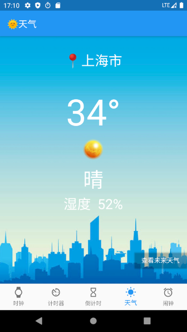
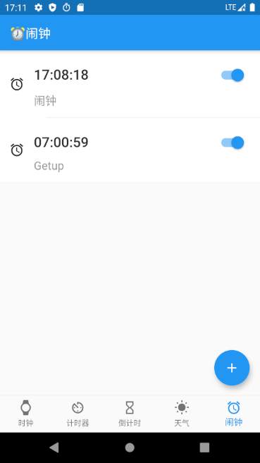
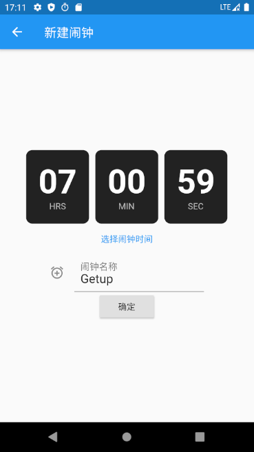
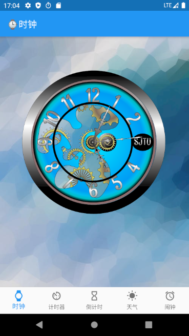
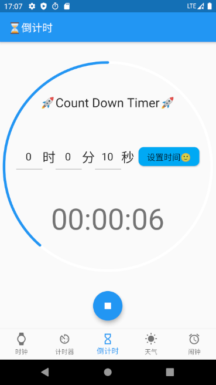

# SJTU Clock

本项目由 [kubi-lxd](https://github.com/kubi-lxd), [Liu-Yuelin](https://github.com/Liu-Yuelin) 和 [sinkinben](https://github.com/Liu-Yuelin) 共同完成，起源于 2020 字节跳动玩转客户端夏令营，主要内容是通过 [Flutter](https://flutter.dev/) 实现一个功能齐全、界面友好的时钟 APP 。

本项目实现的功能包括：

+ ⌚ 时钟
+ ⏲ 计时器
+ ⏳ 倒计时
+ 🌞 天气
+ ⏰ 闹钟

## 配置环境

Flutter 安装教程：

+ Windows: https://flutterchina.club/setup-windows/
+ Linux: https://flutterchina.club/setup-linux/
+ MacOS: https://flutterchina.club/setup-macos/

基本开发环境：

+ Flutter: Channel stable, 1.20.0, on Microsoft Windows10
+ Android SDK: 30.0.1
+ Android Emulator: Google Pixel2 (API 30)
+ IDE: VSCode, AndroidStudio, IDEA 均可

项目具体环境：

+ 项目依赖：参考 `pubspec.yaml` 
+ Android Gradle 插件版本：3.5.0 （参考 `android/build.gradle`）
+ Gradle 版本：5.6.2 （参考 `android/gradle/wrapper/gradle-wrapper.properties`）

❗ Android Gradle 插件版本和 Gradle 版本必须配对，详细要求请参考[Android Gradle 插件版本说明](https://developer.android.google.cn/studio/releases/gradle-plugin?hl=zh-cn) 。

## 运行说明

1. 新建 Android Emulator

   首先通过 Android Studio/IDEA 新建一个 Android Emulator，命名为 Pixel_2_API_30 ，启动之。

   建立完成之后，可以通过 Android Studio 的界面启动，也可以通过命令行启动（VSCode用户）。

   ```
   cd /d/programfiles/Android/AndroidSdk/emulator (AndroidSDK的安装路径)
   ./emulator -avd Pixel_2_API_30
   ```

2. 运行 `flutter doctor` 确认环境配置

   ```
   sin@Lenovo ~ $ flutter doctor
   Doctor summary (to see all details, run flutter doctor -v):
   [✓] Flutter (Channel stable, 1.20.0, on Microsoft Windows [Version 10.0.18363.1016], locale
       zh-CN)
   [✓] Android toolchain - develop for Android devices (Android SDK version 30.0.1)
   [✓] Android Studio (version 4.0)
   [✓] Connected device (1 available)
   • No issues found!
   ```

3. 运行项目

   Android Studio/IDEA 直接点击右上角绿色运行图标，VSCode 则可以通过命令行运行：

   ```
   cd your_project_path
   flutter run
   ```

   等待数秒即可在安卓模拟器中看到 APP 的界面。

## 项目结构

文件名采用纯小写风格命名，代码变量采用驼峰式命名法。

所有代码文件均在 `lib` 文件夹下：

```
lib
│   index.dart
│   main.dart
│   navigation.dart
├───clock
│       model.dart
│       sjtuclock.dart
├───pages
│       emptypage.dart
│       myalarm.dart
│       mycountdowntimer.dart
│       weather.dart
└───stopwatch
        clockdialog.dart
        clockface.dart
        constants.dart
        fancybutton.dart
        stopwatch.dart
```

下面对每个模块逐一说明：

+ `main.dart`：APP 运行入口
+ `index.dart/navgation.dart`：构造菜单栏，控制页面跳转逻辑
+ `clock` 文件夹：时钟模块
+ `stopwatch` 文件夹：计时器模块
+ `pages` 文件夹：每个 `dart` 均对应于一个单独的页面，`myalarm.dart` 是闹钟模块，`mycountdowntimer.dart` 是倒计时模块，`weather` 是天气模块，`emptypage.dart` 是一个空白页面，用于开发测试。

## 效果演示

|        |   |
| :------------------------------------------: | :-------------------------------------: |
|          |     |
|       |  |
|  |                                         |

